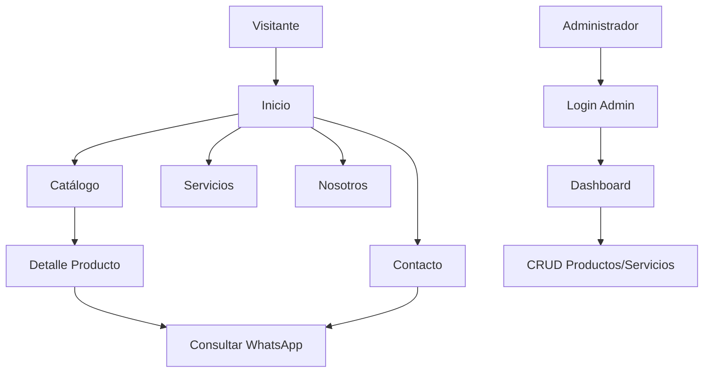

## 1. Product Overview
Nova Bytex es una plataforma web corporativa premium para una empresa dedicada a la comercialización de productos tecnológicos, infraestructura TI, soporte especializado, proyectos y asesoría para empresas. El objetivo es transmitir profesionalismo, innovación y confianza, compitiendo visualmente con marcas como Cisco, Dell, Vercel y Apple Business.

## 2. Core Features

### 2.1 User Roles
| Role | Registration Method | Core Permissions |
|------|-------------------|------------------|
| Visitante | No requiere | Navegar por la página, ver productos y servicios |
| Administrador | Email/Contraseña | CRUD productos, categorías, servicios, banners, usuarios y config |

### 2.2 Feature Module
1. **Página de Inicio: navbar sticky, hero, partners, servicios, productos destacados, beneficios, nosotros, CTA, footer
2. **Catálogo: sidebar categorías/filtros, grid productos, búsqueda y ordenamiento
3. **Detalle Producto: galería, especificaciones, relacionados, CTA WhatsApp
4. **Nosotros**: timeline, misión, visión, valores, equipo
5. **Contacto**: mapa, redes, formulario
6. **Panel Admin: login, dashboard, CRUD productos/categorías/servicios/banners/usuarios/config

### 2.3 Page Details
| Page Name | Module Name | Feature description |
|-----------|-------------|--------------------|
| Inicio | Navbar | Sticky, buscador, botón "Escríbenos" |
| Inicio | Hero | Imagen tecnológica, título grande, 2 CTA |
| Inicio | Partners | Carrusel marcas (Cisco, Dell, HP, Lenovo, etc.) |
| Inicio | Servicios | Tarjetas premium para cada servicio |
| Inicio | Productos Destacados | Slider productos, CTA WhatsApp |
| Inicio | Beneficios | Iconografía moderna |
| Inicio | CTA | Botón "Cotizar por WhatsApp" |
| Catálogo | Sidebar | Categorías, filtros, marcas, estado |
| Catálogo | Grid Productos | Tarjetas elegantes, hover premium |
| Detalle Producto | Galería | Imágenes producto |
| Detalle Producto | Especificaciones | Info detallada |
| Nosotros | Timeline | Historia de la empresa |
| Contacto | Formulario | Envío de mensajes |
| Panel Admin | Dashboard | Resumen métricas |
| Panel Admin | CRUD | Gestión de recursos |

## 3. Core Process
Usuario visita Nova Bytex:
- Navega por el sitio
- Explora servicios y productos
- Consulta por WhatsApp o formulario de contacto
- Administrador gestiona contenido via dashboard
Actualiza productos/servicios

## 4. User Interface Design
### 4.1 Design Style
- **Colores**: Primary #1E40AF, Secondary #0F172A, Accent #38BDF8, Success #22C55E, Background #FFFFFF, Surface #F8FAFC
- **Botones**: Variantes primary, secondary, outline, ghost, icon, con estados hover/active/disabled/loading
- **Tipografía**: Plus Jakarta Sans (principal), Inter (secundaria)
- **Layout**: Clean, minimalista, premium, espacio suficiente entre elementos
- **Iconos**: Lucide React
- **Animaciones**: Framer Motion (sutiles, fade/slide/scale/hover)

### 4.2 Page Design Overview
| Page Name | Module Name | UI Elements |
|-----------|-------------|-------------|
| Inicio | Navbar | Sticky, sombra suave, logo, menú, buscador, botón |
| Inicio | Hero | Imagen hero grande, título destacado, 2 CTA |
| Inicio | Servicios | Tarjetas premium, íconos, hover effects |
| Catálogo | Productos | Grid responsive, tarjetas modernas |
| Detalle Producto | Galería | Slider de imágenes |
| Panel Admin | Dashboard | Tarjetas métricas |

### 4.3 Responsiveness
- Desktop: 1440px
- Tablet: 768px
- Mobile: 390px

### 4.4 SEO
- Metadata optimizada, Open Graph, sitemap, URLs amigables, carga rápida
