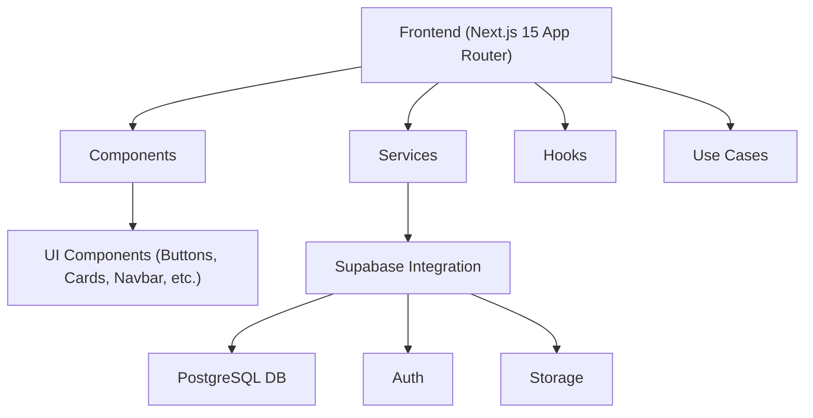
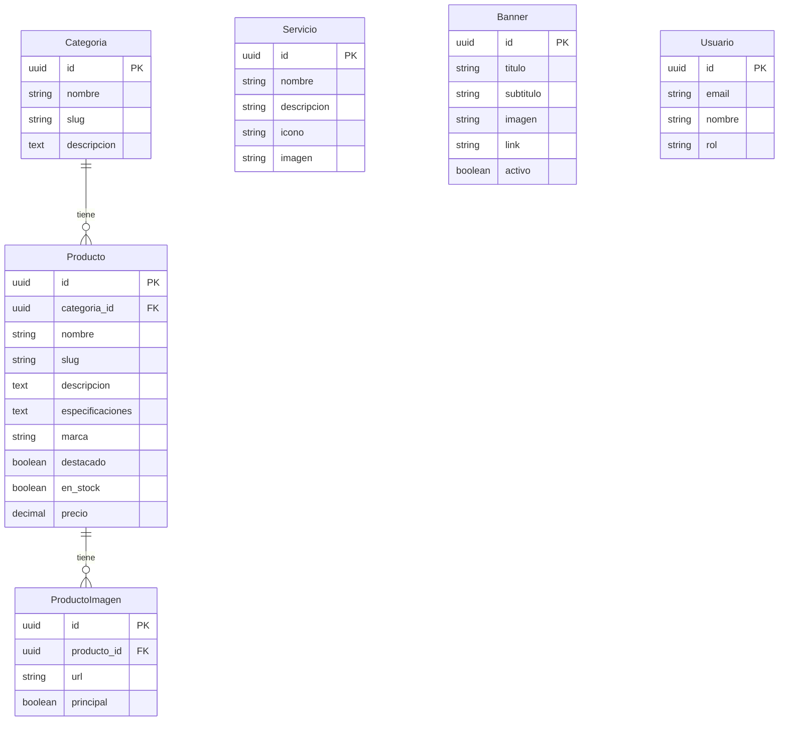

## 1. Architecture Design

## 2. Technology Description
- **Frontend**: Next.js 15 (App Router) + React 19 + TypeScript + TailwindCSS + Shadcn UI + Framer Motion + React Hook Form + Zod + TanStack Query + Lucide React
- **Backend**: Supabase (PostgreSQL, Auth, Storage, RLS, Edge Functions)
- **Arquitectura**: Clean Architecture, SOLID, DRY, KISS, Component Driven Design

## 3. Route Definitions
| Route | Purpose |
|-------|---------|
| / | Inicio (Landing) |
| /productos | Catálogo de productos |
| /productos/[id] | Detalle de producto |
| /servicios | Servicios |
| /nosotros | Nosotros |
| /contacto | Contacto |
| /admin | Panel Admin (Dashboard) |
| /admin/productos | CRUD Productos |
| /admin/categorias | CRUD Categorías |
| /admin/servicios | CRUD Servicios |
| /admin/banners | CRUD Banners |
| /admin/configuracion | Configuración |
| /admin/usuarios | CRUD Usuarios |

## 4. Data Model

